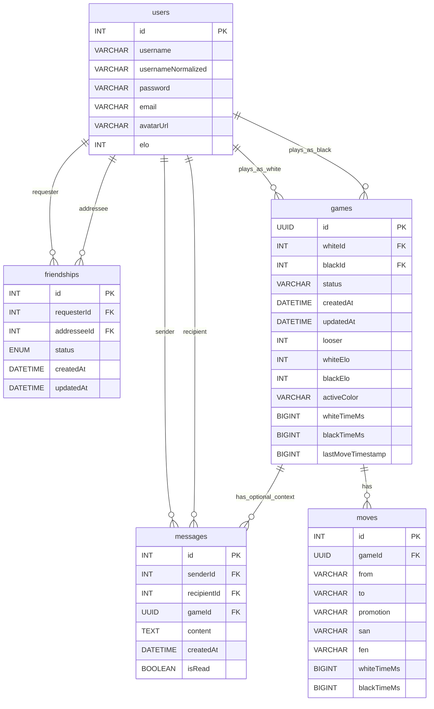

*This project has been created as part of the 42 curriculum by muribe-l, kabasolo, jleon-la, iboiraza.*

# ft_transcendence — Ultra Xake Online

Ultra Xake Online is a full-stack real-time chess web app with matchmaking, friends, chat, match history, and ELO ranking.

## Description

**Ultra Xake Online** is a 42 curriculum project focused on building a modern, secure, full‑stack web application with real-time features.

### Goal

- Provide an online chess experience with real-time gameplay, matchmaking, social features, and persistent player data.

### Key Features (implemented)

- Authentication (register/login) with JWT
- Player profiles (public profile + “me” profile), avatar upload
- Friends system (requests, accept/reject, list, remove)
- Real-time private chat (friends-only) + unread tracking
- Real-time chess matches with:
	- Move validation (chess rules), game end detection (checkmate/draw)
	- Chess clock / timeouts
	- ELO updates on game end
	- Match history
- Matchmaking:
	- Queue-based matchmaking by ELO range
	- Friend invites (time-limited)

## Instructions

### Prerequisites

- Linux
- Docker Engine + Docker Compose v2 (`docker compose`)
- GNU Make
- OpenSSL (used by the Makefile to generate local TLS certs and secrets)

### Configuration

- Environment variables:
	- Template: `srcs/.env.example`
	- Local file used by compose: `srcs/.env`
- Secrets (auto-generated by `make` if missing):
	- `secrets/db_password.txt`
	- `secrets/db_root_password.txt`
	- `secrets/jwt_secret.txt`
	- `secrets/ssl/localhost.crt`, `secrets/ssl/localhost.key`

Notes:

- The stack uses HTTPS locally with a self-signed certificate. Your browser will warn you; accept it for local development.
- Do **not** commit secrets.

### Run (development)

Runs the base compose file plus dev overrides (hot reload via bind mounts + node_modules volumes):

```bash
make dev
```

Open:

- Frontend: `https://localhost:5173`
- Backend: `https://localhost:3000`

### Run (production-style)

Builds and runs the base compose stack:

```bash
make up
```

### Stop / cleanup

```bash
make down
```

### Useful commands

- `make dev` — run full stack with dev overrides
- `make up` — build & run base stack
- `make down` — stop containers and remove volumes
- `make rebuild` — rebuild without cache
- `make clean` — alias for `make down`


### Services and compose files

- Base stack: `srcs/compose.yaml`
- Dev overrides: `srcs/compose.dev.yaml`

Ports are configured in `srcs/.env`:

- `BACKEND_PORT` (default: 3000)
- `FRONTEND_PORT` (default: 5173)
- MariaDB runs inside the Docker network by default.

## Team Information

| Member (login) | Role(s) | Responsibilities |
|---|---|---|
| muribe-l | PM DEV	| Systems like Users ranking and frontend |
| kabasolo | PO DEV	| All the back and front of the Game |
| jleon-la | TL DEV	| Docker and makefile |
| iboiraza | TL DEV	| Systems like languages and chadWidget |

## Project Management

**How we organized the work**

We distributed the work taking into account the experience of each one, like the system side (docker, make), also frontend, making games and experience with frameworks and databases etc.
We spoke about what should everyone do so that we could merge our branches and continue the project.
We tested all the systems and the features, specialy after every merge so we knew that it worked as intended. Then we decided how many features we wanted to keep adding.

**Tools**

- GitHub (issues / pull requests)

**Communication**

- Discord
- Slack
- WhatsApp

## Technical Stack

### Frontend

- SvelteKit (Svelte 5) + Vite (HTTPS dev server)
- Bootstrap
- Socket.IO client

### Backend

- NestJS (TypeScript)
- Socket.IO (WebSockets)
- TypeORM
- JWT + Passport
- chess.js

### Database

- MariaDB

### Major technical choices (justification)

- Why SvelteKit (SPA/SSR, routing, DX)
Because it is a common framework known to work well and some friends recomended it to us.
- Why NestJS (architecture, modules, TS ecosystem)
It is known to be a good match with svelte and we had no problem using typescript
- Why Socket.IO (events, reconnections)
Because we needed websockets for real time events and it comes with other featueres.
- Why MariaDB + TypeORM (relations, consistency, Docker friendliness)
MariaDB just workes fine and typeORM makes our lifes so much easier.

## Database Schema

The schema is defined by TypeORM entities (auto-loaded). In development, `synchronize: true` is enabled in `srcs/requirements/nest/src/database/database.module.ts`.

Notes:

- There is no separate `logs` table in this project: match “logs” are stored as rows in `moves` (one row per move, linked to a `game`).
- Foreign key columns for relations (e.g. `whiteId`, `blackId`, `requesterId`, etc.) are generated by TypeORM from `@ManyToOne` relations.

### Visual schema (Mermaid)



### Entity files (source of truth)

- Users: `srcs/requirements/nest/src/users/user.entity.ts`
- Friendships: `srcs/requirements/nest/src/friends/friendship.entity.ts`
- Messages: `srcs/requirements/nest/src/chat/message.entity.ts`
- Games: `srcs/requirements/nest/src/game/entities/game.entity.ts`
- Moves: `srcs/requirements/nest/src/game/entities/move.entity.ts`

## Features List

| Feature | What it does | Backend | Frontend | Owner(s) |
|---|---|---|---|---|
| Register/Login | Create account + get JWT | `POST /auth/register`, `POST /auth/login` | `/register`, `/login` | muribe-l |
| Profile (“me”) | View/update email | `GET /auth/me`, `PATCH /auth/me` | `/profile` | muribe-l |
| Avatar upload | Upload image (2MB, images only) | `POST /users/me/avatar` | `/profile` | muribe-l |
| Public profile | View other users | `GET /users/:id` | `/profile/:userId` | muribe-l |
| Ranking | Display top players by ELO | `GET /users/ranking/:n` | `/ranking` | muribe-l |
| Friends | Requests + accept/reject + list + remove | `/friends/*` + WS refresh | Chat widget (Friends tab) | muribe-l |
| Private chat | Friends-only DM, unread state | Chat gateway (`/chat`) | Chat widget | iboiraza |
| Matchmaking queue | Queue by ELO range | Matchmaking gateway/service | Home “Play” button | kabasolo |
| Friend invites | Invite friends to a match (TTL) | Matchmaking invites | Invite modal | muribe-l |
| Real-time game | Join game room, propose moves | Game gateway/service | `/game/:gameId` | kabasolo |
| Chess clock | Timeouts per player | ChessClockService | In-game timers | kabasolo |
| Match history | Recent matches list & stats | `getMatchHistory` event | `/historial/:userId` + profile stats | kabasolo |
| Replay (review mode) | Move-by-move replay of a match (navigation through stored moves) | `joinGame` emits full move list (FEN + SAN) | `/game/:gameId` (review mode, arrows + move list) | kabasolo |

## Modules

This project uses the module system described in `en.subject.pdf` (Major = 2 points, Minor = 1 point).

Below is the set of modules that are **implemented in code**. During evaluation, only fully functional modules count.

### Module list & points

| Module | Type | Points | Why chosen | Implementation summary | Owner(s) |
|---|---|---:|---|---|---|
| Use a framework for both the frontend and backend | Major | 2 | Productivity, clear structure | SvelteKit frontend + NestJS backend (TypeScript) | All |
| Implement real-time features using WebSockets (or similar) | Major | 2 | Required for live gameplay and chat | Socket.IO for matchmaking, game events, and chat | kabasolo, iboiraza |
| Allow users to interact with other users (chat/profile/friends) | Major | 2 | Core social layer for the platform | Friends system + profiles + private chat | muribe-l, iboiraza |
| Use an ORM for the database | Minor | 1 | Faster iteration and safer DB access | TypeORM entities + repositories | muribe-l |
| Standard user management and authentication | Major | 2 | Core product requirement | JWT auth, profile update, avatar upload, friends + online activity | muribe-l |
| Implement a complete web-based game (live matches) | Major | 2 | Core gameplay module | Real-time chess matches with rules validation, win/draw logic | kabasolo |
| Remote players (two computers in real-time) | Major | 2 | Real online gameplay | Socket.IO reconnection + client re-joins the game room on reconnect; server re-sends game state | kabasolo |
| Implement spectator mode for games | Minor | 1 | Better UX and evaluation demo | Spectate active games via game id (real-time updates for spectators) | kabasolo, iboiraza |

**Total points (implemented above):** 14

### Modules considered (not yet claimed)

These are modules we considered/count internally, but they are **not** included in the total above until they fully match the subject requirements.

| Module | Type | Points | Current state | What’s missing to safely claim |
|---|---|---:|---|---|
| Game statistics and match history (requires a game module) | Minor | 1 | Partially implemented (match history + W/L/D stats + ELO + leaderboard UI) | Achievements/progression (as described in the subject) or a clear equivalent feature set + explanation in README |
| Support for multiple languages (at least 3 languages) | Minor | 1 | Planned / pending merge from another branch | i18n system, 3 complete translations, language switcher, all text translatable |
| Support for additional browsers | Minor | 1 | Not validated yet | Test and fix for at least 2 additional browsers, document limitations |

### Extra feature (not a scored module)

- Replay (review mode): implemented as part of the game UI using the stored move list; documented here for completeness but **not counted** as an extra subject module.


## Individual Contributions

TODO: Provide a detailed breakdown per team member.

### muribe-l

- TODO: Features/modules/components delivered
- TODO: Hard problems solved / key decisions
- TODO: Challenges faced + how they were overcome


### kabasolo

- TODO

### jleon-la

- TODO

### iboiraza

- TODO

## Resources

### Technical references

- 42 ft_transcendence subject / evaluation notes: `en.subject.pdf`
- NestJS documentation: https://docs.nestjs.com/
- SvelteKit documentation: https://kit.svelte.dev/docs
- Socket.IO documentation: https://socket.io/docs/v4/
- TypeORM documentation: https://typeorm.io/
- MariaDB documentation: https://mariadb.com/kb/en/documentation/
- chess.js documentation: https://github.com/jhlywa/chess.js
- JWT (RFC 7519): https://www.rfc-editor.org/rfc/rfc7519

### AI usage disclosure (required)

We used AI tools to help with debugging and understanding framework features. We validated outputs by reviewing code changes, running the application locally, and checking behavior manually.

| Tool | Used for | Where (files/areas) | Validation |
|---|---|---|---|
| GitHub Copilot | Debugging and understanding framework/library usage, help with the README | Most of the project | Manual testing, code review |
| ChatGPT | Debugging help and conceptual explanations | Some backend services and some frontend parts | Manual testing, cross-checking docs, code review |

## TODO Checklist

- Write individual contributions per member
- Add any known limitations (optional but recommended)
- (Optional) Make AI usage disclosure more precise (feature/file level)

