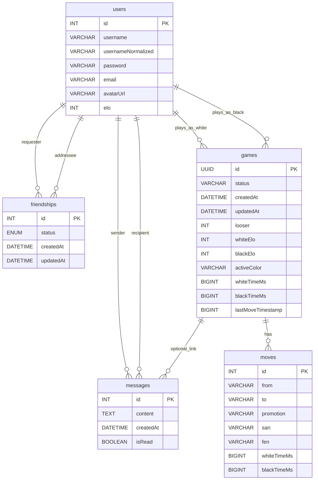

*This project has been created as part of the 42 curriculum by muribe-l, kabasolo, jleon-la, iboiraza.*

# ft_transcendence — Ultra Xake Online

Ultra Xake Online is a full-stack real-time chess web app with matchmaking, friends, chat, match history, and ELO ranking.

## Description

**Ultra Xake Online** is a 42 curriculum project focused on building a modern, secure, full‑stack web application with real-time features.

### Goal

- Provide an online chess experience with real-time gameplay, matchmaking, social features, and persistent player data.

### Key Features (implemented)

- Authentication (register/login) with JWT
- Player profiles (public profile + “me” profile), avatar upload
- Friends system (requests, accept/reject, list, remove)
- Real-time private chat (friends-only) + unread tracking
- Real-time chess matches with:
	- Move validation (chess rules), game end detection (checkmate/draw)
	- Chess clock / timeouts
	- ELO updates on game end
	- Match history
- Matchmaking:
	- Queue-based matchmaking by ELO range
	- Friend invites (time-limited)

## Instructions

### Prerequisites

- Linux
- Docker Engine + Docker Compose v2 (`docker compose`)
- GNU Make
- OpenSSL (used by the Makefile to generate local TLS certs and secrets)

### Configuration

- Environment variables:
	- Template: `srcs/.env.example`
	- Local file used by compose: `srcs/.env`
- Secrets (auto-generated by `make` if missing):
	- `secrets/db_password.txt`
	- `secrets/db_root_password.txt`
	- `secrets/jwt_secret.txt`
	- `secrets/ssl/localhost.crt`, `secrets/ssl/localhost.key`

Notes:

- The stack uses HTTPS locally with a self-signed certificate. Your browser will warn you; accept it for local development.
- Do **not** commit secrets.

### Run (development)

Runs the base compose file plus dev overrides (hot reload via bind mounts + node_modules volumes):

```bash
make dev
```

Open:

- Frontend: `https://localhost:5173`
- Backend: `https://localhost:3000`

### Run (production-style)

Builds and runs the base compose stack:

```bash
make up
```

### Stop / cleanup

```bash
make down
```

### Useful commands

- `make dev` — run full stack with dev overrides
- `make up` — build & run base stack
- `make down` — stop containers and remove volumes
- `make rebuild` — rebuild without cache

### Services and compose files

- Base stack: `srcs/compose.yaml`
- Dev overrides: `srcs/compose.dev.yaml`

Ports are configured in `srcs/.env`:

- `BACKEND_PORT` (default: 3000)
- `FRONTEND_PORT` (default: 5173)
- MariaDB runs inside the Docker network by default.

## Team Information

TODO: Fill roles and responsibilities.

| Member (login) | Role(s) | Responsibilities |
|---|---|---|
| muribe-l | TODO | TODO |
| kabasolo | TODO | TODO |
| jleon-la | TODO | TODO |
| iboiraza | TODO | TODO |

## Project Management

TODO: Replace with your real workflow.

**How we organized the work**

- TODO: Task distribution approach (by feature, by layer, pairing, etc.)
- TODO: Meeting cadence (daily standups, weekly planning, etc.)
- TODO: Definition of done (reviews, CI checks, etc.)

**Tools**

- GitHub (issues / pull requests)
- TODO: Add if used (GitHub Projects / Trello / Notion / etc.)

**Communication**

- Discord
- Slack
- WhatsApp
- TODO: Keep only what you actually used

## Technical Stack

### Frontend

- SvelteKit (Svelte 5) + Vite (HTTPS dev server)
- Bootstrap
- Socket.IO client

### Backend

- NestJS (TypeScript)
- Socket.IO (WebSockets)
- TypeORM
- JWT + Passport
- chess.js

### Database

- MariaDB

### Major technical choices (justification)

TODO: Write your team’s justification in your own words.

- TODO: Why SvelteKit (SPA/SSR, routing, DX)
- TODO: Why NestJS (architecture, modules, TS ecosystem)
- TODO: Why Socket.IO (events, reconnections)
- TODO: Why MariaDB + TypeORM (relations, consistency, Docker friendliness)

## Database Schema

The schema is defined by TypeORM entities (auto-loaded). In development, `synchronize: true` is enabled in `srcs/requirements/nest/src/database/database.module.ts`.

### Visual schema (Mermaid)



### Entity files (source of truth)

- Users: `srcs/requirements/nest/src/users/user.entity.ts`
- Friendships: `srcs/requirements/nest/src/friends/friendship.entity.ts`
- Messages: `srcs/requirements/nest/src/chat/message.entity.ts`
- Games: `srcs/requirements/nest/src/game/entities/game.entity.ts`
- Moves: `srcs/requirements/nest/src/game/entities/move.entity.ts`

## Features List

TODO: Fill in “Owner(s)” with your team members.

| Feature | What it does | Backend | Frontend | Owner(s) |
|---|---|---|---|---|
| Register/Login | Create account + get JWT | `POST /auth/register`, `POST /auth/login` | `/register`, `/login` | TODO |
| Profile (“me”) | View/update email | `GET /auth/me`, `PATCH /auth/me` | `/profile` | TODO |
| Avatar upload | Upload image (2MB, images only) | `POST /users/me/avatar` | `/profile` | TODO |
| Public profile | View other users | `GET /users/:id` | `/profile/:userId` | TODO |
| Ranking | Display top players by ELO | `GET /users/ranking/:n` | `/ranking` | TODO |
| Friends | Requests + accept/reject + list + remove | `/friends/*` + WS refresh | UI in header/profile (TODO: point to page/component) | TODO |
| Private chat | Friends-only DM, unread state | Chat gateway (`/chat`) | Chat widget | TODO |
| Matchmaking queue | Queue by ELO range | Matchmaking gateway/service | Home “Play” button | TODO |
| Friend invites | Invite friends to a match (TTL) | Matchmaking invites | Invite modal | TODO |
| Real-time game | Join game room, propose moves | Game gateway/service | `/game/:gameId` | TODO |
| Chess clock | Timeouts per player | ChessClockService | In-game timers | TODO |
| Match history | Recent matches list & stats | `getMatchHistory` event | `/historial/:userId` + profile stats | TODO |

## Modules

TODO: Fill with your chosen Major/Minor modules and the point total.

### Module list & points

| Module | Type | Points | Why chosen | Implementation summary | Owner(s) |
|---|---|---:|---|---|---|
| TODO | Major/Minor | 2/1 | TODO | TODO | TODO |

**Total points:** TODO

## Individual Contributions

TODO: Provide a detailed breakdown per team member.

### muribe-l

- TODO: Features/modules/components delivered
- TODO: Hard problems solved / key decisions
- TODO: Challenges faced + how they were overcome

### kabasolo

- TODO

### jleon-la

- TODO

### iboiraza

- TODO

## Resources

### Technical references

- 42 ft_transcendence subject / evaluation notes: TODO
- NestJS documentation: https://docs.nestjs.com/
- SvelteKit documentation: https://kit.svelte.dev/docs
- Socket.IO documentation: https://socket.io/docs/v4/
- TypeORM documentation: https://typeorm.io/
- MariaDB documentation: https://mariadb.com/kb/en/documentation/
- chess.js documentation: https://github.com/jhlywa/chess.js
- JWT (RFC 7519): https://www.rfc-editor.org/rfc/rfc7519

### AI usage disclosure (required)

We used AI tools to help with debugging and understanding framework features. We validated outputs by reviewing code changes, running the application locally, and checking behavior manually.

| Tool | Used for | Where (files/areas) | Validation |
|---|---|---|---|
| GitHub Copilot | Debugging and understanding framework/library usage | TODO | Manual testing, code review, running the stack |
| ChatGPT | Debugging help and conceptual explanations | TODO | Manual testing, cross-checking docs, code review |

## TODO Checklist

- Fill team roles + responsibilities
- Fill project management workflow/tools (keep it honest)
- Fill module list + points + justifications
- Assign owners for each feature
- Write individual contributions per member
- Add the exact link/name for the 42 subject/resource you used

