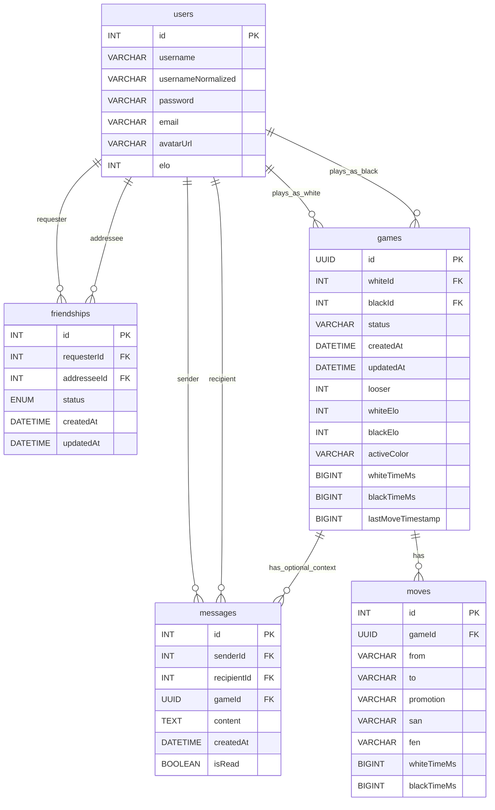

*This project has been created as part of the 42 curriculum by muribe-l, kabasolo, jleon-la, iboiraza.*

# ft_transcendence — Ultra Xake Online

Ultra Xake Online is a full-stack real-time chess web app with matchmaking, friends, chat, match history, and ELO ranking.

## Description

**Ultra Xake Online** is a 42 curriculum project focused on building a modern, secure, full‑stack web application with real-time features.

### Goal

- Provide an online chess experience with real-time gameplay, matchmaking, social features, and persistent player data.

### Key Features (implemented)

- Authentication (register/login) with JWT
- Player profiles (public profile + “me” profile), avatar upload
- Friends system (requests, accept/reject, list, remove)
- Real-time private chat (friends-only) + unread tracking
- Real-time chess matches with:
	- Move validation (chess rules), game end detection (checkmate/draw)
	- Chess clock / timeouts
	- ELO updates on game end
	- Match history
- Matchmaking:
	- Queue-based matchmaking by ELO range
	- Friend invites (time-limited)
- Multi-language UI (i18n) with a language selector (EN/ES/FR/EU)
- Player stats + basic achievements (derived from match history)
- In-game chat + spectator-friendly game rooms (join by game id)

## Instructions

### Prerequisites

- Linux
- Docker Engine + Docker Compose v2 (`docker compose`)
- GNU Make
- OpenSSL (used by the Makefile to generate local TLS certs and secrets)

### Configuration

- Environment variables:
	- Template: `srcs/.env.example`
	- Local file used by compose: `srcs/.env`
- Secrets (auto-generated by `make` if missing):
	- `secrets/db_password.txt`
	- `secrets/db_root_password.txt`
	- `secrets/jwt_secret.txt`
	- `secrets/ssl/localhost.crt`, `secrets/ssl/localhost.key`

Notes:

- The stack uses HTTPS locally with a self-signed certificate. Your browser will warn you; accept it for local development.
- You might have to accept the backend ssl aswell, do this trying to access the port 3000 of the host ip in the browser.
- Do **not** commit secrets.

### Before running (important)

- Run `make` once (no arguments) to prepare the local development environment. The Makefile now creates all required secrets first (database passwords, JWT secret, TLS certs), then generates `srcs/.env` from `srcs/.env.example` if it's missing.

- After the first `make`, edit `srcs/.env` and set `VITE_API_URL` to your machine's local (LAN) IP if you want other devices on your network to access the frontend. Then run `make up` to build and start the stack.

- The first `make` will print exactly the following block (and exit cleanly with no Make error):

```
==========================================================================
 [make] Created ./srcs/.env from ./srcs/.env.example.
   IMPORTANT: Edit ./srcs/.env and change the variables appropriately
   specifically VITE_API_URL to your locally hosted IP to run on network!
   Once configured, run 'make up' or 'make dev'.
==========================================================================
```

- You will also see explicit messages showing that random secrets were created, for example:

```
[make] Created secrets/db_password.txt
[make] Created secrets/db_root_password.txt
[make] Created secrets/jwt_secret.txt
[make] Created secrets/ssl/localhost.key and localhost.crt
```

- Configuration note: the `ensure-env` target deliberately exits cleanly after generating `srcs/.env` to avoid surfacing an `Error 1` to the console; you only need to edit `srcs/.env` and run `make up` afterwards.

### Run (development)

Runs the base compose file plus dev overrides (hot reload via bind mounts + node_modules volumes):

```bash
make dev
```

Open:

- Frontend: `https://localhost:5173`
- Backend: `https://localhost:3000`
- DevOps Status Page: `http://localhost:8080` (provides access to database backups)

### Run (production-style)

Builds and runs the base compose stack:

```bash
make up
```

- `make down` — stop containers and remove volumes (and prune unused Docker resources)
- `make rebuild` — rebuild without cache
- `make all` — generate secrets + TLS certs (and ensure `srcs/.env` exists)
- `make clean` — alias for `make down`
 ### DevOps / Infrastructure

 - Docker and Docker Compose
 - GNU Make for project automation
 - OpenSSL for local TLS certificates and generated secrets
- `make clean-secrets` — delete generated secrets and TLS certs
- `make fclean` / `make reset` — full reset (down + delete secrets + remove images)
- `make re` — full reset + restart
 It gives us file-based routing, a clean component model, and a good development experience.
 It fits the project well because it is modular, strongly typed, and easy to structure for services, gateways, and controllers.
 We needed real-time communication for chat, matchmaking, and live games, and Socket.IO handles reconnects well.
 MariaDB works well for the project, and TypeORM makes entity-based development and relations straightforward.

- `BACKEND_PORT` (default: 3000)
- `FRONTEND_PORT` (default: 5173)
- MariaDB runs inside the Docker network by default.

## Team Information
| Member (login) | Role(s) | Responsibilities |
|---|---|---|
| muribe-l | PM DEV | Users/Auth/Ranking systems + related frontend |
| kabasolo | PO DEV | Game system (backend + frontend), replay, clock, matchmaking |
| jleon-la | TL DEV | Docker, Compose, Makefile (secrets/SSL automation) |
| iboiraza | TL DEV | i18n (multi-language), chat widget, friends UX (incl. friends “leaderboard”) |

## Project Management
We distributed the work according to each person’s strengths, such as system work (Docker, Makefile automation), frontend work, gameplay systems, and framework/database integration.
We discussed responsibilities before implementation so branches could be merged cleanly and the project could keep moving forward.
We tested the full stack and the features, especially after each merge, to make sure everything kept working as intended.

**Tools**

- GitHub (issues / pull requests)

**Communication**

- Discord
- Slack
- WhatsApp

## Technical Stack

### Frontend

- SvelteKit with Svelte 5 and Vite
- Bootstrap for responsive layout and styling
- svelte-i18n for translations and the language selector
- socket.io-client for real-time communication with the backend

### Backend

- NestJS with TypeScript
- Socket.IO and Nest WebSockets for real-time gameplay, chat, and matchmaking
- TypeORM with MariaDB
- JWT authentication with Passport local and JWT strategies
- chess.js for move validation and game-state logic
- bcrypt, class-validator, class-transformer, and ConfigModule for authentication, validation, and configuration
- File uploads handled through the Nest/Express stack for user avatars

### Database

- MariaDB

### DevOps / Infrastructure

- Docker and Docker Compose
- GNU Make for project automation
- OpenSSL for local TLS certificates and generated secrets

### Major technical choices

- Why SvelteKit (SPA/SSR, routing, DX)
	It gives us file-based routing, a clean component model, and a good development experience.
- Why NestJS (architecture, modules, TS ecosystem)
	It fits the project well because it is modular, strongly typed, and easy to structure for services, gateways, and controllers.
- Why Socket.IO (events, reconnections)
	We needed real-time communication for chat, matchmaking, and live games, and Socket.IO handles reconnects well.
- Why MariaDB + TypeORM (relations, consistency, Docker friendliness)
	MariaDB works well for the project, and TypeORM makes entity-based development and relations straightforward.

## Database Schema

The schema is defined by TypeORM entities (auto-loaded). In development, `synchronize: true` is enabled in `srcs/requirements/nest/src/database/database.module.ts`.

Notes:

- There is no separate `logs` table in this project: match “logs” are stored as rows in `moves` (one row per move, linked to a `game`).
- Foreign key columns for relations (e.g. `whiteId`, `blackId`, `requesterId`, etc.) are generated by TypeORM from `@ManyToOne` relations.

### Visual schema (Mermaid)



### Entity files (source of truth)

- Users: `srcs/requirements/nest/src/users/user.entity.ts`
- Friendships: `srcs/requirements/nest/src/friends/friendship.entity.ts`
- Messages: `srcs/requirements/nest/src/chat/message.entity.ts`
- Games: `srcs/requirements/nest/src/game/entities/game.entity.ts`
- Moves: `srcs/requirements/nest/src/game/entities/move.entity.ts`

## Features List

| Feature | What it does | Backend | Frontend | Owner(s) |
|---|---|---|---|---|
| Register/Login | Create account + get JWT | `POST /auth/register`, `POST /auth/login` | `/register`, `/login` | muribe-l |
| Profile (“me”) | View/update email | `GET /auth/me`, `PATCH /auth/me` | `/profile` | muribe-l |
| Avatar upload | Upload image (2MB, images only) | `POST /users/me/avatar` | `/profile` | muribe-l |
| Public profile | View other users | `GET /users/:id` | `/profile/:userId` | muribe-l |
| Ranking | Display top players by ELO | `GET /users/ranking/:n` | `/ranking` | muribe-l |
| Multi-language UI (i18n) | Translate UI + switch language | N/A | Language selector + translated UI | iboiraza |
| Friends | Requests + accept/reject + list + remove | `/friends/*` + WS refresh | Chat widget (Friends tab) | muribe-l |
| Friends “leaderboard” | Sort friends list by ELO | `GET /friends` | Chat widget (Friends tab) | iboiraza |
| Private chat | Friends-only DM, unread state | Chat gateway (`/chat`) | Chat widget | iboiraza |
| Matchmaking queue | Queue by ELO range | Matchmaking gateway/service | Home “Play” button | kabasolo |
| Friend invites | Invite friends to a match (TTL) | Matchmaking invites | Invite modal | muribe-l |
| Real-time game | Join game room, propose moves | Game gateway/service | `/game/:gameId` | kabasolo |
| In-game chat | Chat inside a match room | `sendMessage` event | `/game/:gameId` | kabasolo |
| Chess clock | Timeouts per player | ChessClockService | In-game timers | kabasolo |
| Match history | Recent matches list & stats | `getMatchHistory` event | `/historial/:userId` + profile stats | kabasolo |
| Stats + achievements | Compute W/L/D + show basic achievements | `getMatchHistory` event | `/profile` | kabasolo |
| Replay (review mode) | Move-by-move replay of a match (navigation through stored moves) | `joinGame` emits full move list (FEN + SAN) | `/game/:gameId` (review mode, arrows + move list) | kabasolo |
| Spectator mode | Watch an ongoing game by id with real-time updates | `joinGame` + `moveMade` events | `/game/:gameId` | kabasolo, iboiraza |
| DevOps Status/Backup Page | View system status and access database backups | Custom Apache server in `backuper` container | `http://localhost:8080` | jleon-la |

## Modules

This project uses the module system described in `en.subject.pdf` (Major = 2 points, Minor = 1 point).

Below is the set of modules that are **implemented in code**. During evaluation, only fully functional modules count.

### Module list & points

| Module | Type | Points | Why chosen | Implementation summary | Owner(s) |
|---|---|---:|---|---|---|
| Use a framework for both the frontend and backend | Major | 2 | Productivity, clear structure | SvelteKit frontend + NestJS backend (TypeScript) | All |
| Implement real-time features using WebSockets (or similar) | Major | 2 | Required for live gameplay and chat | Socket.IO for matchmaking, game events, and chat | kabasolo, iboiraza |
| Allow users to interact with other users (chat/profile/friends) | Major | 2 | Core social layer for the platform | Friends system + profiles + private chat | muribe-l, iboiraza |
| Support for multiple languages (at least 3) | Minor | 1 | Better UX + subject requirement | `svelte-i18n` with 4 locales (EN/ES/FR/EU) + language selector; core UI text is translated via locale JSON files | iboiraza |
| Use an ORM for the database | Minor | 1 | Faster iteration and safer DB access | TypeORM entities + repositories | muribe-l |
| Standard user management and authentication | Major | 2 | Core product requirement | JWT auth, profile update, avatar upload, friends + online activity | muribe-l |
| Implement a complete web-based game (live matches) | Major | 2 | Core gameplay module | Real-time chess matches with rules validation, win/draw logic | kabasolo |
| Remote players (two computers in real-time) | Major | 2 | Real online gameplay | Socket.IO reconnection + client re-joins the game room on reconnect; server re-sends game state | kabasolo |
| Implement spectator mode for games | Minor | 1 | Better UX and evaluation demo | Spectate active games via game id (real-time updates for spectators) | kabasolo, iboiraza |
| Support for additional browsers | Minor | 1 | We work on different browsers | Tested in various browsers| All |
| Game statistics and match history  | Minor | 1 | (match history + W/L/D stats + ELO + leaderboard UI + basic achievements UI) | Full progression system (persistent level/XP/badges/etc.) and/or a clearer achievement/progression spec stored in DB | kabasolo |
| Infrastructure for log management | Major | 2 | Required for logs centralization | Infrastructure for log management using ELK (Elasticsearch, Logstash, Kibana) | jleon-la |
| Monitoring system | Major | 2 | Better system visibility | Monitoring system with Prometheus and Grafana | jleon-la |
| Backend as microservices | Major | 2 | Application scalablity | Backend structured as loosely-coupled microservices with clear interfaces | jleon-la |
| Health check and status page | Minor | 1 | Disaster recovery & uptime | Health check and status page system with automated backups and disaster recovery procedures | jleon-la |

## Extra module
| Module | Type | Points | Why chosen | Owner(s) |
|---|---|---:|---|---|
|  Replay (review mode) | Minor | 1 | implemented as part of the game UI using the stored move list; useful for reviewing a finished match | kabasolo |

**Total points (implemented above):** 24


## Individual Contributions

Note: the number of “features” per person is not directly comparable — some items (like the real-time game) are large, multi-week systems, while other contributions are smaller but numerous (auth/users/ranking, UI/UX iterations, etc.).

### muribe-l

- Users/Auth/Ranking systems + related frontend (as listed in the features/modules above)
- Main challenges: learning Svelte/Nest/TypeScript from scratch and integrating everything cleanly
- Worked through merge/integration issues after branch merges to keep features working together

### kabasolo

- Game system end-to-end (backend + frontend): real-time matches, move handling, win/draw/end detection
- Replay/review mode (move-by-move navigation using stored moves)
- Chess clock / timeouts
- Match history + stats used by the profile “achievements” view

### jleon-la

- Docker/Compose setup and overall project automation
- Compose configuration for base stack + dev overrides (`srcs/compose.yaml`, `srcs/compose.dev.yaml`)
- Makefile workflow for the project lifecycle (`make dev`, `make up`, `make down`, `make rebuild`, etc.)
- Secrets automation (auto-generate DB passwords + JWT secret if missing)
- Local HTTPS automation (self-signed TLS cert generation for `localhost`)
- Full reset tooling for evaluators/teammates (remove containers/volumes/images + generated secrets)
- DevOps modules: ELK stack for logs, Prometheus/Grafana for monitoring, microservices architecture, and health/backup systems

### iboiraza

- Multi-language system (i18n) and language selector
- Chat widget UX (friends/messages) and related interactions
- Friends “leaderboard” behavior (friends list sorted by ELO)

## Resources

### Technical references

- 42 ft_transcendence subject / evaluation notes: `en.subject.pdf`
- NestJS documentation: https://docs.nestjs.com/
- SvelteKit documentation: https://kit.svelte.dev/docs
- Socket.IO documentation: https://socket.io/docs/v4/
- TypeORM documentation: https://typeorm.io/
- MariaDB documentation: https://mariadb.com/kb/en/documentation/
- chess.js documentation: https://github.com/jhlywa/chess.js
- JWT (RFC 7519): https://www.rfc-editor.org/rfc/rfc7519

### AI usage disclosure

We used AI tools to help with debugging and understanding framework features. We validated outputs by reviewing code changes, running the application locally, and checking behavior manually.

| Tool | Used for | Where (files/areas) | Validation |
|---|---|---|---|
| GitHub Copilot | Debugging and understanding framework/library usage, help with the README | Most of the project | Manual testing, code review |
| ChatGPT | Debugging help and conceptual explanations | Some backend services and some frontend parts | Manual testing, cross-checking docs, code review |


